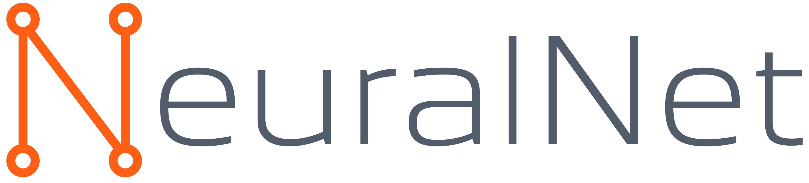

<div align="center">
  
</div>


# Computer Vision Utilities by NeuralNet

Welcome to the Computer Vision Utilities repository! This collection of tools is designed to aid in the development and deployment of computer vision models such as YOLO, Detectron2, and other related models. The utilities encompass a variety of functions from handling images and labels to data augmentation and model management.

## Table of Contents

- [Features](#features)
- [Installation](#installation)
- [Usage](#usage)
- [Contributing](#contributing)
- [Support](#support)
- [Contact](#contact)
- [License](#license)

## Features

This repository includes the following folders and their general purposes:

- **draw_interactive_line/**: Tools for drawing interactive lines on images.

- **get_frames_from_video/**: Scripts to extract frames from video files.

- **opencv_show_ipvideo/**: Resources for displaying IP video streams using OpenCV.

- **reduce_size_video/**: Functions and scripts to reduce the size of video files.

- **rotate_video_180/**: Scripts for rotating videos by 180 degrees.

- **segmentation_utils/**: Utilities and scripts for image segmentation tasks, including annotation, preprocessing, and model evaluation.

- **send_stream_video/**: Tools for sending and managing video streams.

- **yolo_utils/**: Utilities for managing YOLO models, including training, inference, and evaluation.

## Installation

To install the required dependencies, use the following command:

```bash
pip install -r requirements.txt
```

For specific utilities, additional packages may be required as outlined in their respective folders.

## Usage

Each folder contains scripts and tools designed to be run independently. Please refer to the inline comments and documentation within each script for specific usage instructions. 

## Segmentation Utils

The `segmentation_utils` folder includes various tools for image segmentation tasks. These utilities are crucial for preparing and processing data, training segmentation models, and evaluating the results. They are designed to support a wide range of segmentation models and datasets.

## YOLO Utils

The `yolo_utils` folder contains scripts and functions specifically tailored for working with YOLO models. These utilities facilitate tasks such as training YOLO models, performing inference on images and video, and evaluating model performance. This makes it easier to integrate YOLO into your computer vision projects seamlessly.

## Contributing

We welcome contributions from the community! Here's how you can help:

1. Fork the repository.
2. Create a new branch: `git checkout -b my-feature-branch`.
3. Commit your changes: `git commit -m 'Add some feature'`.
4. Push to the branch: `git push origin my-feature-branch`.
5. Submit a pull request.

Please make sure your code follows our [contribution guidelines](CONTRIBUTING.md).

## Support

If you run into any issues or have questions, feel free to open an issue on GitHub or contact us directly via email.

## Contact

NeuralNet  
Website: [https://neuralnet.solutions](https://neuralnet.solutions)  
Email: info[at]neuralnet.solutions

## License

This repository is licensed under the MIT License. See the [LICENSE](LICENSE) file for more information.
