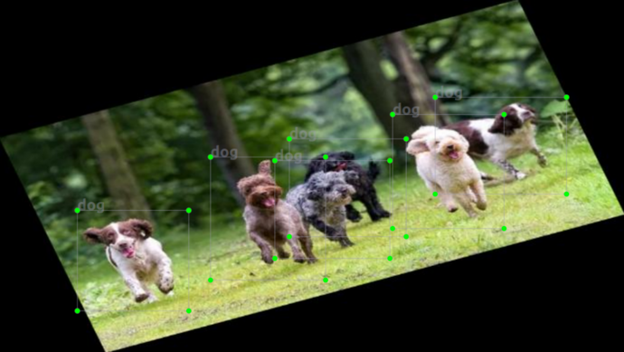
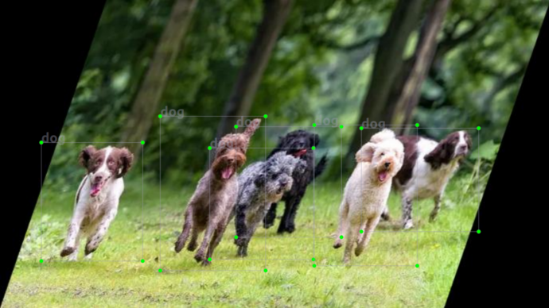
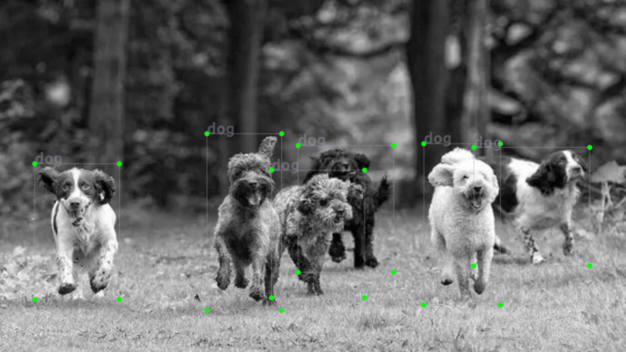

# Data augmentation for the whole image

## Quick Start

The structure to run the script is:

`python full_data_aug.py -i [DATASET INPUT] -o [DATASET OUTPUT] --flags`

How to run, there are two ways:

1) Run with its options

    ```
    python full_data_aug.py --horizontal_flip
    python full_data_aug.py --random_scale
    python full_data_aug.py --random_translate
    python full_data_aug.py --rotate
    python full_data_aug.py --random_shear
    python full_data_aug.py --random_HSV
    python full_data_aug.py --random_noise
    python full_data_aug.py --random_bright_contrast
    python full_data_aug.py --sequence
    python full_data_aug.py --copy_orig
    python full_data_aug.py --gray
    ```
	
	Add the flags you need, example:
	
	`python full_data_aug.py -i [DATASET INPUT] -o [DATASET OUTPUT] --random_scale --random_translate --rotate --random_shear --random_HSV --random_noise --random_bright_contrast`
	
	`python full_data_aug.py -i [DATASET INPUT] -o [DATASET OUTPUT] --random_translate --rotate`
	
2) Run all data augmentations

    `python full_data_aug.py -i [DATASET INPUT] -o [DATASET OUTPUT] --full`


## Data Augmentation

* Original photo


* Horizontal Flip


* Random Scale


* Random Translate


* Rotate



* Random Shear



* Random HSV


* Random Noise


* Random Bright Contrast


* Gray



