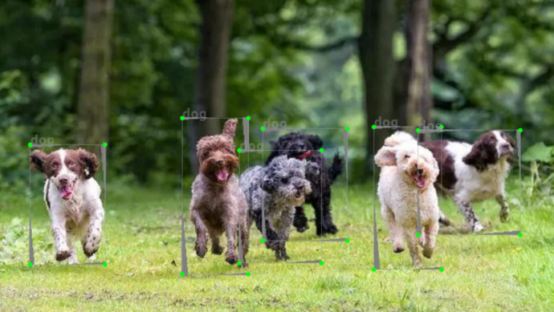
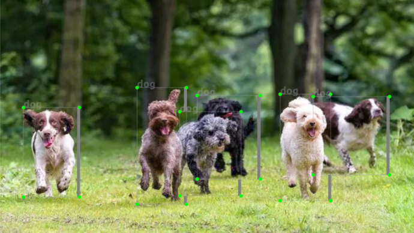
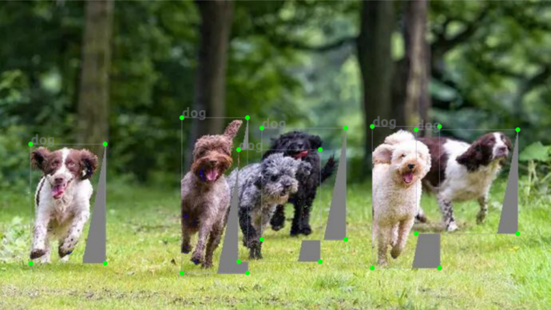
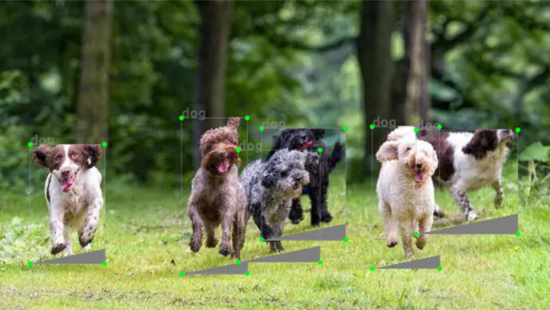
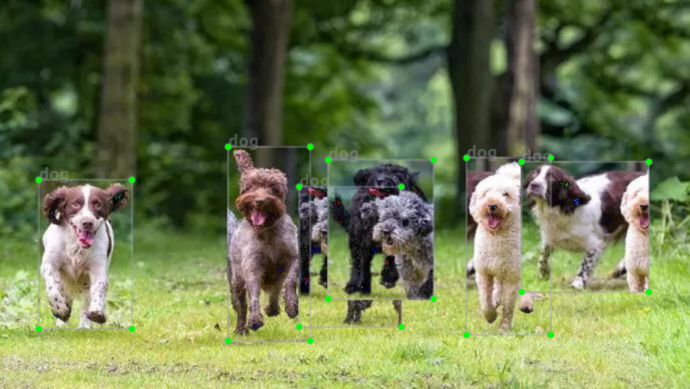
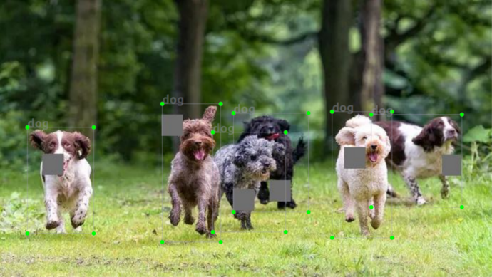
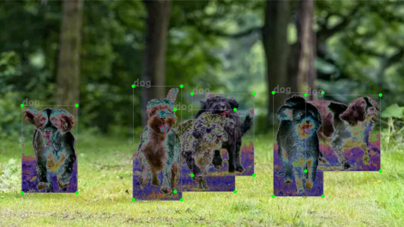
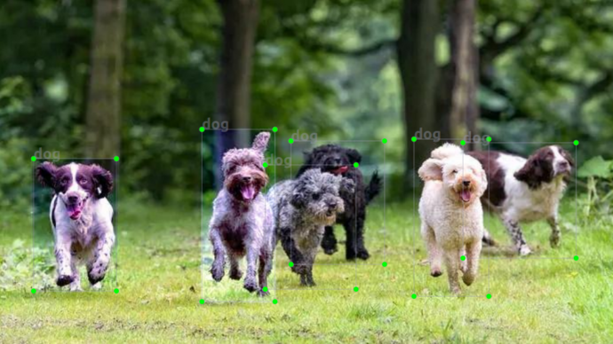

# Data augmentation for bounding boxes

## Geometric

### Quick Start

The structure to run the script is:

`python geometric_bboxes.py -i [DATASET INPUT] -o [DATASET OUTPUT] --flags`

How to run, there are two ways:

1) Run with its options

    ```
	python geometric_bboxes.py --rotate
    python geometric_bboxes.py --translateX
    python geometric_bboxes.py --translateY
    python geometric_bboxes.py --shearX
    python geometric_bboxes.py --shearY
    python geometric_bboxes.py --flip
    python geometric_bboxes.py --full
	```
    
	Add the flags you need, example:
	
    `python geometric_bboxes.py -i [DATASET INPUT] -o [DATASET OUTPUT] --rotate --
	translateX --translateY --shearX --shearY`
	
    `python geometric_bboxes.py -i [DATASET INPUT] -o [DATASET OUTPUT] --rotate --flip`
    
2) Run all data augmentations

    `python geometric_bboxes.py -i [DATASET INPUT] -o [DATASET OUTPUT] --full`

### Data Augmentation

* Original photo


* Rotate



* TranslateX



* TranslateY


* ShearX



* ShearY



* Flip




## Color

### Quick Start

The structure to run the script is:

`python color_bboxes.py -i [DATASET INPUT] -o [DATASET OUTPUT] --flags`

How to run, there are two ways:

1) Run with its options

    ```
	python color_bboxes.py --cutout
    python color_bboxes.py --solarize
    python color_bboxes.py --equalize
	```
    
	Add the flags you need, example:
	
    `python color_bboxes.py -i [DATASET INPUT] -o [DATASET OUTPUT] --solarize --equalize`
    
2) Run all data augmentations

    `python color_bboxes.py -i [DATASET INPUT] -o [DATASET OUTPUT] --full`

### Data Augmentation

* Original photo


* Cutout



* Solarize



* Equalize




